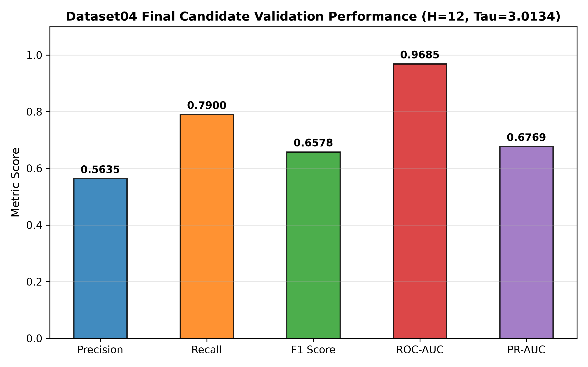
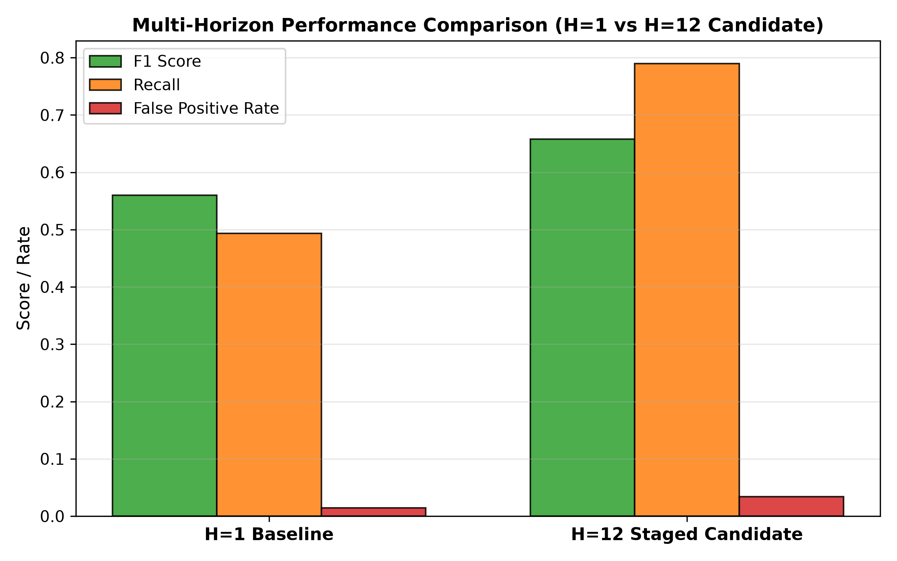
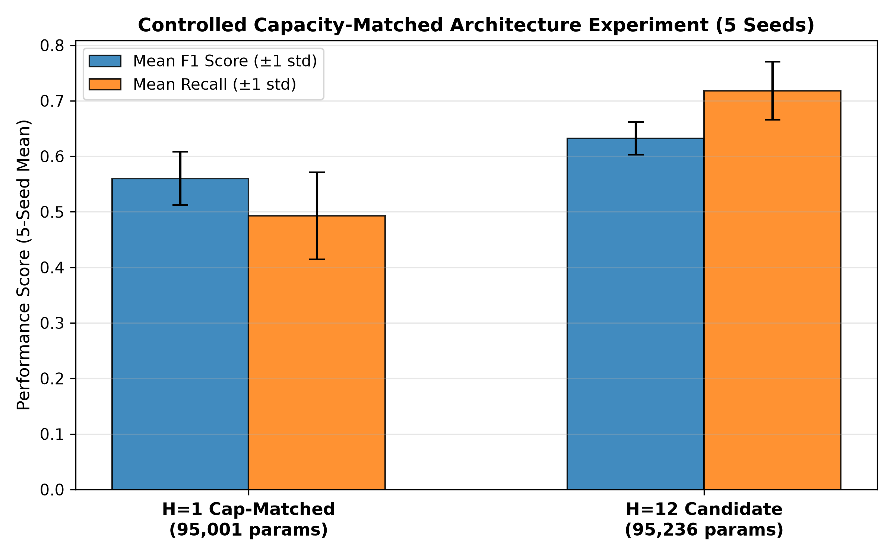
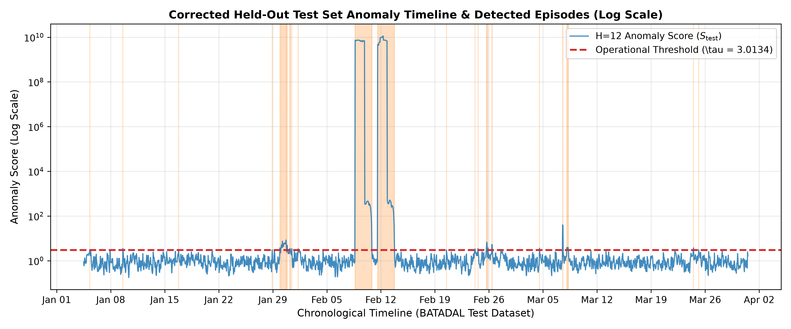
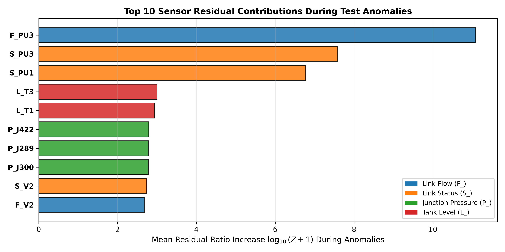
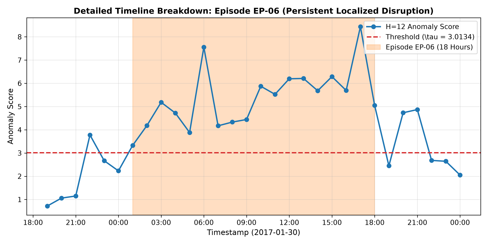
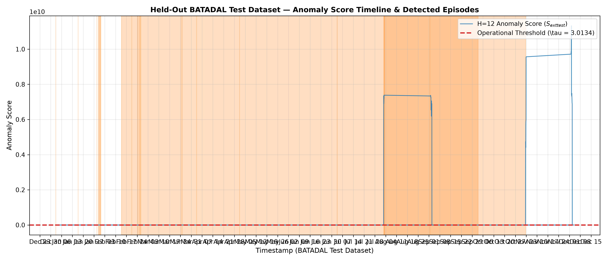

# X-Resilience-WDS

A spatio-temporal Graph Neural Network framework for detecting operational anomalies in water distribution systems using normal-only forecasting and sensor-topology-aware reasoning.

## Project overview

This project applies a graph-based forecasting model to the BATADAL water distribution benchmark. Instead of learning from attack data, the system is trained on normal operation and flags anomalies when observed sensor behavior deviates sharply from predicted normal dynamics.

The result is an explainable anomaly detection pipeline for cyber-physical water systems, combining:

- graph-based spatial modeling across network topology
- temporal forecasting for multi-step residual prediction
- anomaly threshold calibration on normal data
- episode-level detection and sensor attribution
- operational dashboarding and research artifact generation

---

## At-a-glance metrics

| Item | Result |
|---|---:|
| Model architecture | Spatio-Temporal GNN, direct multi-horizon forecasting (H=12) |
| Production checkpoint | `models/detection_gnn.pt` |
| Calibrated threshold | 3.013382 |
| Validation dataset | BATADAL_dataset04 |
| Precision | 0.5635 |
| Recall | 0.7900 |
| F1 score | 0.6578 |
| ROC-AUC | 0.9685 |
| PR-AUC | 0.6769 |
| Test suite status | 48 / 48 passed |

---

## Why this project matters

Water distribution systems are complex cyber-physical networks where small operational shifts can cascade across pressure, flow, and storage dynamics. The project focuses on identifying abnormal behavior early while avoiding alarmist interpretations that are disconnected from the physical system.

Key scientific principles:

- Learn only from normal system behavior
- Detect deviations using forecasting residuals, not labeled attacks
- Preserve topology-aware sensor relationships
- Separate statistical anomaly detection from confirmatory operational conclusions
- Provide human-readable explanations through sensor attribution and region mapping

---

## Working details

### Modeling approach

The system models the network as a graph where sensors correspond to physically connected infrastructure elements such as junctions, tanks, pump states, and flow measurements. A multi-horizon forecasting head predicts future sensor values from recent history, and residuals are aggregated into a statistical anomaly score.

### Operational workflow

1. Load and preprocess BATADAL time-series data
2. Build topology-aware graph relationships from the C-Town network
3. Train on normal operation only
4. Calibrate a threshold against normal validation windows
5. Evaluate on labeled benchmark data (Dataset04)
6. Run unsupervised inference on the held-out test set
7. Aggregate contiguous anomaly episodes and rank sensor drivers
8. Publish results, figures, and dashboard artifacts

### Important caveat

This project works on synthetic benchmark data generated by hydraulic simulation rather than real municipal field measurements. That means the outputs are scientifically useful for benchmarking and anomaly detection research, but they are not direct field-validated operational alerts.

---

## Output gallery

### 1) Dataset04 validation overview



This figure summarizes the labeled validation benchmark and highlights the model's ability to separate anomalies from normal operation using a threshold calibrated on the normal partition.

### 2) Forecast horizon comparison



The multi-horizon design is compared against shorter forecasting horizons to show how longer-step forecasting improves difficult sequence detection while managing error accumulation.

### 3) Capacity-controlled comparison



A parameter-matched ablation shows that the H=12 model improves recall because of the forecasting strategy itself, not because it simply has more capacity.

### 4) Held-out test anomaly timeline



This timeline highlights the detection profile over the full held-out test period and shows the anomaly threshold crossing across contiguous episodes.

### 5) Sensor attribution analysis



The attribution view identifies which sensors contribute most strongly to each anomaly episode, helping connect rising residuals to specific physical components.

### 6) High-severity episode profile



Selected episodes such as EP-12 expose how near-zero baseline variance in pump states can amplify anomaly scores and why operational interpretation must remain careful and evidence-based.

### 7) Dashboard output generation workflow

This exact screenshot is the output of the dashboard built in `dashboard/app.py`. It is not a live sensor stream; it is a rendered visualization of the model’s saved inference results.

The dashboard flow is:

1. The GNN forecasts normal system behavior on the held-out BATADAL test set.
2. It computes a residual-based anomaly score for each forecasting window.
3. These values are written to result files such as `results/test_inference/test_anomaly_scores.csv` and `results/test_inference/test_anomaly_episodes.csv`.
4. The Streamlit dashboard reads those artifacts, creates a time-series chart, overlays the operational threshold, and highlights anomalous windows.
5. Additional dashboard tabs then show episode severity, sensor attribution, and topology-based interpretation.

## Dashboard Screenshot



Figure: Operational anomaly dashboard output showing the anomaly-score timeline for the held-out test period. The red dashed baseline represents the calibrated detection threshold, and the highlighted points indicate windows classified as statistical anomalies. This view is generated by loading the saved inference output files into the Streamlit application and visualizing them in an operational dashboard format.

What is happening in this dashboard screenshot:

- The x-axis represents time across the held-out test period.
- The y-axis shows the anomaly score, displayed in the log-scaled format used for a clearer operational view.
- The red dashed horizontal line is the calibrated operating threshold, approximately 3.013382, which marks the decision boundary for anomaly detection.
- The red marker points indicate windows that exceeded the threshold and were flagged as statistical anomalies.
- The overall curve shows how the system’s residual deviation rises and falls over time, revealing periods of abnormal hydraulic activity.
- These flagged regions are later grouped into contiguous anomaly episodes for summarization in the dashboard’s episode explorer.

In practical terms, the dashboard is translating the model’s computed anomaly signal into a readable operational timeline so engineers can review when abnormal behavior began, how severe it was, and which sensors contributed most strongly to the deviation.

.png)
Dashboard Overview : The X-Resilience-WDS dashboard provides an overview of the water distribution system monitoring framework, including anomaly detection, sensor attribution, topology mapping, ground-truth validation, and interactive simulation. It displays monitored sensor categories and provides controls to configure and analyze different operational disturbances.

.png)
Anomaly Detection and Simulation : This section allows users to simulate disturbances in monitored components by selecting the component, disturbance type, magnitude, and duration. It displays the affected sensor, baseline and simulated anomaly scores, detection threshold, and model response. The signal plot compares normal and disturbed sensor behavior, while the score chart indicates whether the simulated anomaly exceeds the threshold.

.png)
Root-Cause Analysis and Impact Assessment : This section identifies the suspected source of abnormal behavior using model-based evidence and the configured disturbance information. It traces the affected component through connected network nodes and neighboring sensors, examines potential alternative routes, and provides recommended mitigation actions for investigating and resolving the disturbance.

.png)
Explainable AI Analysis : This section uses SHAP and LIME to explain the sensors contributing to the model's anomaly prediction. It compares the feature importance produced by both methods and maps the selected sensors to their corresponding physical components and topology regions. An agreement indicator highlights differences between the explanations to support cautious interpretation.

.png)
Explainable Incident Summary : This section consolidates the simulation results into a structured incident report containing the affected component, anomaly score, detection threshold, primary evidence, root-cause hypothesis, network impact, SHAP and LIME results, and recommended response. It provides a concise overview for understanding and documenting the simulated incident.

.png)
Dashboard Controls : The sidebar provides controls for selecting the anomaly timeline's display scale and setting a minimum operational severity filter. Users can switch between logarithmic and raw statistical anomaly scores and filter events according to the configured severity threshold, making the displayed results easier to investigate.


---

## Key takeaways

- The H=12 model achieves strong benchmark performance with recall of 0.7900 and ROC-AUC of 0.9685.
- Multi-horizon forecasting provides real gains over shorter-horizon baselines when capacity is held nearly constant.
- The system works well for sequence-level anomaly detection and episode grouping across the test window.
- Sensor attribution helps interpret likely affected system components, though it should not be treated as direct proof of attack cause.
- The PU3 case demonstrates a critical limitation: extremely large scores can arise from near-zero variance during inactive states, which is a valid mathematical behavior rather than a data corruption issue.
- The project is designed for research-grade operational analysis, with careful terminology and dashboarding to avoid overstating findings.

---

## Repository structure

```text
X-Resilience-WDS/
├── configs/
│   └── config.yaml
├── dashboard/
│   ├── app.py
│   └── README.md
├── data/
│   ├── raw/
│   └── processed/
├── models/
│   ├── detection_gnn.pt
│   └── backups/
├── results/
│   ├── final_figures/
│   ├── production_readiness/
│   ├── test_inference/
│   ├── *.json
│   ├── *.csv
│   └── README.md
├── scratch/
│   ├── run_*.py
│   └── audit_*.py
├── src/
│   ├── detection/
│   ├── explainability/
│   ├── impact/
│   ├── localization/
│   ├── network/
│   ├── recovery/
│   ├── root_cause/
│   ├── README.md
│   └── __init__.py
├── tests/
├── requirements.txt
├── .gitignore
├── README.md
└── .venv/
```

---

## Running the project

### Install dependencies

```bash
python -m venv .venv
.venv\Scripts\activate
pip install -r requirements.txt
```

### Run the full test suite

```bash
pytest -v
```

### Launch the dashboard

```bash
.venv\Scripts\python.exe -m streamlit run dashboard/app.py --server.port 8501
```

---

## Project outputs and artifacts

The repository produces several types of outputs:

- model checkpoints in `models/`
- benchmark metric reports in `results/`
- validation and ablation studies as JSON/CSV results
- high-resolution publication figures in `results/final_figures/`
- operational dashboard summaries and sensitivity analysis
- episode-level anomaly tables for test inference

Notable files:

- `results/final_results_summary.md`
- `results/final_h12_validation_report.json`
- `results/test_inference/test_anomaly_episodes.csv`
- `results/test_inference/test_anomaly_scores.csv`
- `results/production_readiness/production_readiness_report.md`

---

## Summary

X-Resilience-WDS is a research and operations-oriented anomaly detection project for water distribution systems. It delivers an explainable forecasting pipeline, strong benchmark performance, and a visual dashboard for inspecting anomaly episodes and sensor-level drivers.

Its main value is not simply classification accuracy, but the combination of:

- robust machine learning for normal-only anomaly detection
- physically meaningful topology-aware explanation
- detailed operational reporting for decision support
- traceable analysis artifacts for validation and review

This makes it a strong foundation for further work in resilient monitoring, infrastructure risk detection, and cyber-physical validation studies.
